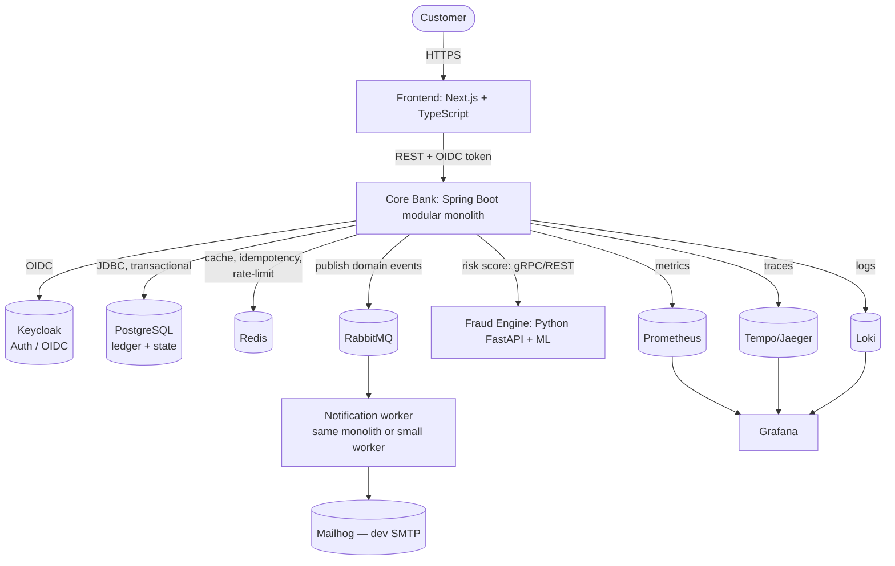

# Mini-Bank — Implementation Plan

> **Project type:** Learning + portfolio. Full-stack. Backend-first, UI later.
> **Working name:** `ledger-bank` (rename freely).
> **One-line pitch:** A simulated retail bank built on a correct, immutable **double-entry ledger**, with idempotent money operations, real concurrency guarantees, observability, and a modern UI.

---

## 0. Read this first — the honest framing

A "banking app" is one of the most common portfolio projects in existence. Reviewers have seen hundreds. **Most of them are quietly wrong in the same way**: they keep a mutable `balance` column and `UPDATE` it on every transfer. That is not how money systems work, and it is exactly the thing that decides whether this project impresses or gets skimmed past.

So this plan is built around a small number of things that actually create signal, and treats everything else as supporting cast:

1. **Money is an immutable double-entry ledger, not a mutable balance.** Balances are *derived*. This is the spine of the whole project (see §3).
2. **Concurrency is proven, not assumed.** A test fires thousands of concurrent transfers and asserts money is conserved to the cent (see §3.5 and §8).
3. **Money operations are idempotent.** A retried request can never double-charge (see §3.4).
4. **Decisions are documented.** Architecture Decision Records (ADRs) explain *why*, because judgment is the hardest thing to fake and the most valuable thing to show (see §11).

Two standing rules that override any feature ambition:

- **Finish a working slice early.** The #1 failure mode of ambitious portfolio projects is *never shipping*. A half-built bank signals "can't finish" louder than a small complete one signals "limited scope." Phase 1 (§7) is a real, demoable, end-to-end bank. Get it solid before expanding.
- **Match complexity to the problem.** A learning bank with zero real users does **not** need microservices, Kafka, Kubernetes, and event sourcing to be good. Some advanced tools are included here *explicitly to learn them* — those are flagged **`[learning-driven]`**. The framing that earns respect from senior reviewers is: *"I used X to learn it; at this scale I'd actually just use Postgres."* Self-awareness beats naive over-engineering every time.

**Explicitly out of scope** (rabbit holes that add risk, not signal): real KYC/AML compliance, real payment rails (SWIFT/ACH/SEPA), real card networks, regulatory reporting, production-grade FX trading. This is a *simulation*. Saying so in your README is itself a sign of good judgment.

---

## Table of contents

1. [Guiding principles](#1-guiding-principles)
2. [Architecture overview](#2-architecture-overview)
3. [The core domain — double-entry ledger](#3-the-core-domain--double-entry-ledger)
4. [Technology stack](#4-technology-stack)
5. [Why polyglot, and where](#5-why-polyglot-and-where)
6. [DevOps, tooling & pipelines](#6-devops-tooling--pipelines)
7. [Phased roadmap](#7-phased-roadmap)
8. [Testing strategy](#8-testing-strategy)
9. [Security checklist](#9-security-checklist)
10. [Repository structure](#10-repository-structure)
11. [Architecture Decision Records](#11-architecture-decision-records-adrs)
12. [Diagrams to produce](#12-diagrams-to-produce)
13. [What makes this stand out](#13-what-makes-this-stand-out)
14. [Pitfalls to avoid](#14-pitfalls-to-avoid)

---

## 1. Guiding principles

These are the engineering principles the codebase should visibly demonstrate:

- **Domain-Driven Design (tactical):** aggregates, value objects, domain events. The domain layer has *zero* framework dependencies.
- **Hexagonal / Ports & Adapters:** business logic at the center; databases, HTTP, messaging, and external services are plug-in adapters at the edge. This makes the core testable without Spring.
- **SOLID** and a clean dependency direction: dependencies point *inward*, toward the domain.
- **Twelve-Factor App:** config from environment, stateless processes, logs as event streams, dev/prod parity via containers.
- **Testing pyramid:** lots of fast unit tests, a solid layer of integration tests against *real* infrastructure (Testcontainers), a thin layer of end-to-end tests.
- **Everything in version control, everything reproducible:** `docker compose up` and a single command should boot the whole system locally.
- **Observability is a first-class feature**, not an afterthought: logs, metrics, and traces (the three pillars).

---

## 2. Architecture overview

### 2.1 The shape: modular monolith + one justified service

**Recommendation: a modular monolith for the core bank, plus exactly one separate service (the fraud/risk engine in Python), plus the frontend.**

This is a deliberate, defensible choice, and I'd push back hard on going microservices-first:

- A monolith with **clean internal module boundaries** teaches you good design (bounded contexts, dependency rules) *without* the distributed-systems tax (network failures, distributed transactions, eventual consistency, service discovery, tracing across 12 hops).
- The boundaries are drawn so that *if* you ever wanted to split into microservices, the seams are already there. **Demonstrating you know where the seams are, and choosing not to cut them, is stronger signal than cutting them prematurely.**
- The *one* genuine reason to break a service out is a different runtime/language — which is exactly the case for the ML-based fraud engine (see §5).

### 2.2 Internal modules (bounded contexts) inside the Java monolith

Each is a package/module with an explicit public API; cross-module calls go through that API, never into another module's internals. Enforce this with **ArchUnit** tests and/or Spring Modulith.

- `identity` — users, credentials, profiles (or delegated to Keycloak; see §4).
- `accounts` — account lifecycle (open, freeze, close), account metadata.
- `ledger` — **the core.** Postings, entries, balances, the invariant. Source of truth for money.
- `payments` — transfers, deposits, withdrawals, standing orders, reversals. Orchestrates the ledger.
- `statements` — derived views: transaction history, periodic statements, exports.
- `notifications` — async dispatch (email/in-app) driven by domain events.
- `audit` — append-only record of every state-changing action.

### 2.3 System view (C4 container level)



---

## 3. The core domain — double-entry ledger

**This section is the heart of the project. If you nail nothing else, nail this.**

### 3.1 The accounting model

In strict double-entry bookkeeping, **every financial event is recorded as a set of entries whose signed amounts sum to exactly zero.** Money is never created or destroyed inside the system; it only moves between accounts. This gives you a beautiful, testable global invariant:

> **The sum of all signed ledger entries across all accounts is always exactly `0`.**

To make deposits and withdrawals (money entering/leaving "the bank") balance, you include **system accounts** that represent the outside world (e.g., a `CASH`/`EXTERNAL_CLEARING` account). A customer deposit is then *not* "money from nowhere" — it's a transfer from the external clearing account to the customer account. The books always balance.

### 3.2 Core entities

- **`Account`** — a customer-facing or system account. Has: id, owner, type (`CHECKING`, `SAVINGS`, `SYSTEM_CLEARING`, `SYSTEM_EQUITY`), currency, status. Customer accounts may not go below their allowed minimum (overdraft rules); system accounts may go negative (they model the outside world).
- **`Posting`** (a.k.a. journal entry / transaction) — an **immutable** group of two or more `LedgerEntry` rows that together sum to zero. Carries an idempotency key, a type, a timestamp, and metadata. *Once written, never updated or deleted.*
- **`LedgerEntry`** — **immutable.** `(posting_id, account_id, signed_amount, currency, created_at)`. The single source of truth for money.
- **`AccountBalance`** — a *derived* snapshot: the running balance of an account, updated **atomically inside the same DB transaction** as the entries that change it. It is a cache of the ledger, reconcilable at any time by re-summing entries.

**Reversals and refunds are new compensating postings, never edits.** A wrong transfer is corrected by posting its inverse, leaving a complete, immutable audit trail.

### 3.3 Money representation — get this exactly right

- **Never use `float`/`double` for money. Ever.**
- **Storage:** store amounts as **integer minor units** (`BIGINT`, e.g. cents) wrapped in a `Money` value object — *or* `NUMERIC(19,4)` in Postgres with `BigDecimal` in Java. Both are acceptable; integer minor units avoid rounding entirely and are slightly simpler. Pick one and be consistent.
- **Rate math (interest, fees):** do it in `BigDecimal` with an explicit rounding mode — **`HALF_EVEN` (banker's rounding)** is the financial standard — and post the rounded result.
- **Always carry a `currency`.** Even if you launch single-currency, model it now so multi-currency later isn't a rewrite.

A `Money` value object (immutable, validates currency match on arithmetic, no public setters) is a small thing that signals you understand value objects and defensive domain modeling.

### 3.4 Idempotency — non-negotiable for money

Clients retry. Networks drop responses *after* the server committed. Without protection, a retry = a double transfer.

- Every money-moving endpoint requires an **`Idempotency-Key`** header (client-generated UUID).
- On first use: process, store `(key → result, status)` (in Postgres for durability; Redis is a fast first-line check).
- On replay of the same key: **return the stored result without re-processing.**
- Same key + *different* request body ⇒ `409 Conflict`.

### 3.5 Concurrency — the part most projects fumble

Two transfers touching the same account at the same instant must not corrupt the balance or violate overdraft rules.

**Recommended approach: pessimistic locking with deterministic lock ordering.**

- Within the transfer transaction, `SELECT ... FOR UPDATE` the affected `account_balance` rows.
- **Always acquire locks in a consistent order** (e.g., sort by account UUID ascending) to make deadlocks impossible.
- Isolation level `READ COMMITTED` is sufficient *with* row locks.

**Alternative to discuss in an ADR: optimistic locking** (`@Version` column, retry on conflict) — better under low contention, requires a retry loop. `SERIALIZABLE` isolation with serialization-failure retries is a third option. Documenting *why you chose pessimistic + lock ordering* over these is exactly the kind of reasoning that stands out.

### 3.6 Schema sketch (Postgres)

```sql
-- Accounts (customer-facing and system)
CREATE TABLE account (
    id           UUID PRIMARY KEY,
    owner_id     UUID,                         -- null for system accounts
    type         TEXT NOT NULL,                -- CHECKING, SAVINGS, SYSTEM_CLEARING, ...
    currency     CHAR(3) NOT NULL,
    status       TEXT NOT NULL DEFAULT 'ACTIVE',
    created_at   TIMESTAMPTZ NOT NULL DEFAULT now()
);

-- A posting groups balanced entries. Immutable.
CREATE TABLE posting (
    id               UUID PRIMARY KEY,
    type             TEXT NOT NULL,            -- TRANSFER, DEPOSIT, WITHDRAWAL, REVERSAL, ...
    idempotency_key  TEXT NOT NULL UNIQUE,
    description      TEXT,
    created_at       TIMESTAMPTZ NOT NULL DEFAULT now()
);

-- The source of truth for money. Immutable. amount is signed, in minor units.
CREATE TABLE ledger_entry (
    id           BIGSERIAL PRIMARY KEY,
    posting_id   UUID NOT NULL REFERENCES posting(id),
    account_id   UUID NOT NULL REFERENCES account(id),
    amount       BIGINT NOT NULL,              -- signed minor units; debits negative, credits positive (pick a convention)
    currency     CHAR(3) NOT NULL,
    created_at   TIMESTAMPTZ NOT NULL DEFAULT now()
);
CREATE INDEX idx_entry_account ON ledger_entry(account_id, id);

-- Derived snapshot, updated in the SAME transaction as the entries above.
CREATE TABLE account_balance (
    account_id   UUID PRIMARY KEY REFERENCES account(id),
    balance      BIGINT NOT NULL DEFAULT 0,    -- minor units
    version      BIGINT NOT NULL DEFAULT 0,    -- for optional optimistic locking
    updated_at   TIMESTAMPTZ NOT NULL DEFAULT now()
);

-- Durable idempotency record.
CREATE TABLE idempotency_record (
    key          TEXT PRIMARY KEY,
    request_hash TEXT NOT NULL,
    response     JSONB,
    status       TEXT NOT NULL,                -- IN_PROGRESS, COMPLETED
    created_at   TIMESTAMPTZ NOT NULL DEFAULT now()
);
```

**Database-enforced invariant (recommended):** add a deferred constraint trigger that checks each posting's entries sum to zero before commit. The database itself then refuses to store an unbalanced posting — a strong correctness guarantee independent of application code.

### 3.7 Transfer flow (pseudocode)

```
transfer(fromId, toId, amount, idempotencyKey):
    if idempotencyKey already COMPLETED -> return stored result
    begin transaction:
        lock balances for [fromId, toId] in sorted order  (SELECT ... FOR UPDATE)
        assert from.balance - amount >= from.minAllowed     (overdraft check)
        posting = new Posting(TRANSFER, idempotencyKey)
        insert ledger_entry(posting, fromId, -amount)
        insert ledger_entry(posting, toId,   +amount)
        from.balance -= amount;  to.balance += amount        (update snapshot)
        store idempotency_record(key -> result, COMPLETED)
    commit
    publish MoneyTransferred domain event   (after commit; drives audit, notifications, fraud)
    return result
```

---

## 4. Technology stack

> Versions: target the **current LTS / latest stable** when you scaffold (Java 21 or 25 — both LTS, 25 is newest; Spring Boot 3.x latest). Verify exact versions at scaffold time rather than pinning from this doc.

| Concern | Choice | Why | Alternatives considered |
|---|---|---|---|
| **Core language** | **Java 21/25 (LTS)** | Your strength; mature, excellent for transactional systems. Virtual threads (Project Loom) let the simple servlet stack scale. | Kotlin (great, but stick to your strength) |
| **Backend framework** | **Spring Boot 3.x (Spring MVC)** | Industry standard, what reviewers expect, huge ecosystem. | Quarkus, Micronaut (faster startup, smaller community) |
| **Web style** | **Spring MVC + virtual threads** | For a DB-bound transactional app, blocking + virtual threads is simpler and just as scalable as reactive. | **WebFlux** — *deliberately rejected*: reactive complexity buys little here; document this in an ADR |
| **Persistence** | **Spring Data JPA / Hibernate**, drop to native SQL for the hot ledger paths | Productive for CRUD; explicit control where money correctness matters | jOOQ (type-safe SQL — great, optional `[learning-driven]`), plain JDBC |
| **Database** | **PostgreSQL** | ACID, rock-solid, free, ubiquitous. The ledger lives here. | MySQL (fine); never NoSQL for the ledger |
| **Migrations** | **Flyway** | Simple, versioned, SQL-first | Liquibase (more features, more ceremony) |
| **Auth / IAM** | **Keycloak** (OIDC/OAuth2) | A *real* identity provider; teaches OIDC properly; runs in Docker | Spring Authorization Server, or hand-rolled JWT (`[learning-driven]` alternative for more control) |
| **AuthZ** | Spring Security, role + resource-based | Standard, integrates with Keycloak tokens | — |
| **Cache / ephemeral** | **Redis** | Idempotency fast-path, rate limiting, caching, token denylist | — |
| **Messaging** | **RabbitMQ** | Right fit for task/command + event fan-out (notifications, async fraud). Teaches AMQP | **Kafka** — `[learning-driven]`, only if you want event-streaming/event-sourcing; flag it as such, don't add it for the résumé |
| **Mapping / boilerplate** | MapStruct + Lombok | Less hand-written DTO/entity glue | Java records + manual mapping |
| **API docs** | springdoc-openapi (Swagger UI) | Auto-generated, interactive, covers the "no UI yet" gap | — |
| **Internal service calls** | **gRPC** (Java ↔ Python) or REST | gRPC = typed contracts, fast; good to learn. REST is the simpler fallback | REST + OpenAPI |
| **Frontend framework** | **Next.js + TypeScript** | Modern, polished, employable; SSR + great DX. Worth learning TS as a Java dev | Plain React + Vite; **Vaadin/Thymeleaf** (JVM-only) rejected — won't deliver the "modern UI" you want |
| **UI styling/components** | **Tailwind CSS + shadcn/ui** | *The* current way to get a beautiful, accessible UI fast | MUI, Chakra |
| **Frontend data/state** | **TanStack Query** (server state) + **Zustand** (light client state) | Caching, retries, optimistic updates done right | Redux Toolkit (heavier) |
| **Forms / validation** | React Hook Form + **Zod** | Type-safe, ergonomic | Formik + Yup |
| **Charts** | Recharts | Simple, good-looking financial charts | visx (lower-level) |
| **Fraud/risk engine** | **Python + FastAPI + scikit-learn** | The one genuinely-justified polyglot piece (see §5) | Go (only if learning Go is the goal) |
| **Load testing** | **k6** | Simple, scriptable, great reports | Gatling (JVM/Scala — stays in your ecosystem) |

---

## 5. Why polyglot, and where

You said: *"in parts that rely on more computing or where a more powerful stack exists, use another technology."* Here's the **one place that genuinely justifies it** (rather than language tourism):

### Fraud / risk scoring → Python (FastAPI + scikit-learn)

- **Why it's justified, not résumé-padding:** real-time risk scoring is an ML/statistics problem, and Python's ecosystem (scikit-learn, pandas, numpy) is genuinely *better* than Java's for it. This is a textbook "right tool for the job" story — the kind reviewers respect.
- **What it does:** the Java core calls it on each money movement (sync gRPC/REST, or async via RabbitMQ for non-blocking checks). The service returns a risk score; high-risk transactions get held/flagged. Start with simple rules (velocity, amount thresholds, unusual destination), then graduate to a trained model (e.g., isolation forest for anomaly detection) — a clean learning arc.
- **The honest framing for your README:** *"Java owns correctness and money; Python owns the ML. The boundary is a different runtime, which is the legitimate reason to make it a separate service."*

**Optional `[learning-driven]` second language:** if you want to learn **Go**, a high-throughput API gateway or a fast batch settlement component is a reasonable place — but be honest that Java handles both fine, and you're doing it to learn Go, not because the problem demands it.

---

## 6. DevOps, tooling & pipelines

You asked for the full software-engineering pipeline. Here it is — with the genuinely-essential items separated from the **`[learning-driven]`** ones.

### 6.1 Containerization & local orchestration (essential)

- **Docker** — multi-stage builds; small, non-root runtime images.
- **Docker Compose** — the heart of local dev. One `docker compose up` boots: Postgres, Redis, Keycloak, RabbitMQ, the core bank, the fraud service, the frontend, Mailhog, and the observability stack. **This reproducibility is itself strong signal.**
- A **`Makefile`** (or `Taskfile`) wrapping the common commands (`make up`, `make test`, `make lint`, `make seed`).

### 6.2 CI/CD (essential)

- **GitHub Actions** — integrates with your GitHub portfolio, free for public repos. Pipeline stages:
  1. **Build** (Maven/Gradle; recommend **Gradle** with the wrapper, or Maven if you prefer).
  2. **Test** — unit + integration with **Testcontainers** (real Postgres/Redis in CI).
  3. **Static analysis & quality gate** (see below).
  4. **Security scan** (see below).
  5. **Build & publish container images** (GHCR — GitHub Container Registry).
- Branch protection: PRs required, CI must pass, no direct pushes to `main`.

### 6.3 Code quality (essential, cheap, high-signal)

- **Spotless** (auto-format) + **Checkstyle** — consistent style, enforced in CI.
- **SpotBugs** / **PMD** — static bug detection.
- **JaCoCo** — coverage, with a sensible gate (e.g., fail under 70–80% on the domain layer; don't chase 100%).
- **SonarCloud** — free for public repos; code smells, coverage, duplication, a quality gate badge for your README.
- **ArchUnit** — *enforce the architecture in tests* (e.g., "domain must not depend on Spring", "no module reaches into another's internals"). This is an underused, high-signal tool.

### 6.4 Security (essential)

- **OWASP Dependency-Check** and/or **Trivy** — scan dependencies and container images for known CVEs, in CI.
- **Dependabot** — automated dependency-update PRs (GitHub-native).
- **gitleaks** — secret scanning so you never commit a credential.
- Pre-commit hooks running format + lint + secret scan locally.

### 6.5 Observability (essential — and a genuine differentiator)

- **Metrics:** Spring Boot Actuator + **Micrometer** → **Prometheus** → **Grafana** dashboards.
- **Tracing:** **OpenTelemetry** → **Tempo** (or Jaeger). Trace a transfer end-to-end, including the call into the Python fraud service.
- **Logging:** structured **JSON logs** (Logback + a JSON encoder) → **Loki** → Grafana.
- This is the "**LGTM**" stack (Loki, Grafana, Tempo, Metrics/Prometheus) — modern, all open-source, all containerized in your Compose file.

### 6.6 Advanced / optional — clearly labeled

- **`[learning-driven]` Kubernetes** — local with **kind**/**k3d**/minikube, plus a **Helm** chart. **Not required for the app to work; Docker Compose is sufficient.** Add only if learning k8s is a goal, and *say so in your README* — that honesty reads as maturity, not as a gap.
- **`[learning-driven]` Terraform** — only if you deploy to a cloud (a cheap VPS or a free tier). Optional.
- **`[learning-driven]` Kafka + event sourcing** — only if you specifically want to learn event streaming; RabbitMQ already covers the messaging needs.
- **Conventional Commits + semantic versioning** (e.g., release-please) — nice-to-have polish.

---

## 7. Phased roadmap

> Each phase ends with a **Definition of Done (DoD)** and a **demoable artifact**. Do not start a phase before the previous one's DoD is met. Keep `main` always-demoable.

### Phase 0 — Foundation `[~1 unit]`
Scaffolding only; no business logic.
- [ ] Monorepo created; `Makefile`; README skeleton.
- [ ] Docker Compose with Postgres (+ pgAdmin optional).
- [ ] Spring Boot skeleton, Flyway, Actuator health endpoint.
- [ ] CI skeleton: build + run tests on every PR.
- [ ] **ADR-0001:** modular monolith over microservices. **ADR-0002:** money representation.

**DoD:** `docker compose up` boots a healthy (empty) app; CI is green. **Demo:** health check + a passing CI badge.

### Phase 1 — Minimum finishable core (the thin E2E slice) `[the most important phase]`
A *real, working bank* at the API level.
- [ ] Auth: register/login (Keycloak or JWT); protected endpoints.
- [ ] Open a customer account.
- [ ] **Double-entry ledger** (entries, postings, balanced-posting DB constraint).
- [ ] Two money operations: **deposit** (from system clearing account) and **transfer** (account → account).
- [ ] **Derived/snapshot balance**, updated atomically with entries.
- [ ] **Idempotency** on money endpoints.
- [ ] Transaction history endpoint.
- [ ] **Concurrency invariant test** (see §8) — money conserved under load.
- [ ] OpenAPI/Swagger UI.
- [ ] Seed script + a Postman collection (covers the "no UI yet" gap).

**DoD:** you can register, open accounts, deposit, transfer, and read history end-to-end via API; the invariant test passes under concurrency. **Demo:** Swagger UI + the green concurrency test. **→ Stop here and make it genuinely solid before expanding.**

### Phase 2 — Harden & expand the backend `[~2 units]`
- [ ] Withdrawals; external-deposit modeling via clearing account.
- [ ] **Reversals/refunds** as compensating postings (never deletes).
- [ ] Standing orders / scheduled transfers (`@Scheduled` or Quartz).
- [ ] Statements (date-range; PDF export is a nice touch).
- [ ] Rate limiting (Redis).
- [ ] RFC 7807 `application/problem+json` error model.
- [ ] **Observability:** Actuator + Prometheus + Grafana + tracing + structured logs.
- [ ] **Audit log:** append-only, every state change.

**DoD:** a feature-complete single-currency bank with full observability and audit. **Demo:** a Grafana dashboard showing a live transfer traced end-to-end.

### Phase 3 — Polyglot + async `[~2 units]`
- [ ] **Python fraud service** (FastAPI): rules first, then a simple anomaly model.
- [ ] Java core calls it (gRPC/REST), or async via RabbitMQ; high-risk → held/flagged.
- [ ] **RabbitMQ:** domain events drive async notifications + fraud checks.
- [ ] Notification worker → email via **Mailhog** (dev).

**DoD:** a flagged suspicious transfer is held and visible; events flow through RabbitMQ. **Demo:** trigger a "fraudulent" transfer and watch it get held; trace it across both services.

### Phase 4 — Frontend `[~2–3 units]`
- [ ] Next.js + TS + Tailwind + shadcn/ui.
- [ ] OIDC login (Keycloak), protected routes.
- [ ] Dashboard: balances, charts, recent activity.
- [ ] Transfer flow (with optimistic UI + idempotency key).
- [ ] Transaction history + statements.
- [ ] Responsive, accessible, genuinely polished.

**DoD:** a beautiful, modern UI exercising the full backend. **Demo:** the full app, click-through.

### Phase 5 — DevOps & quality polish `[~1–2 units]`
- [ ] Full CI/CD: SonarCloud quality gate, Trivy/OWASP scans, coverage gate, image publish to GHCR.
- [ ] ArchUnit architecture tests in CI.
- [ ] **Load test** (k6/Gatling) + a short performance writeup.
- [ ] **`[learning-driven]`** (pick what you actually want to learn): k8s + Helm; Terraform; Kafka event stream.

**DoD:** green pipeline with quality + security gates and badges; a load-test report. **Demo:** the CI pipeline + badges + load-test numbers.

### Phase 6 — Documentation & presentation `[ongoing, finalized last]`
- [ ] ADRs written throughout (not bolted on at the end).
- [ ] **C4 diagrams** (§12).
- [ ] Excellent README: what/why, architecture, how to run, the ledger design, the invariant test, screenshots/GIFs.
- [ ] A short writeup of the **ledger + concurrency design** — this is your "wow" piece; consider a blog post or a dedicated `docs/LEDGER.md`.

**DoD:** a stranger can understand, run, and be impressed by the project from the README alone.

---

## 8. Testing strategy

- **Unit tests** (fast, no Spring): domain logic, `Money`, posting balancing, overdraft rules.
- **Integration tests** with **Testcontainers**: real Postgres/Redis/RabbitMQ spun up in Docker for the test run. Tests the real persistence and locking behavior — *far* more credible than H2/mocks.
- **API tests:** REST Assured or `MockMvc`/`WebTestClient` against the running context.
- **Contract tests** (optional): between the Java core and the Python fraud service (e.g., Pact).
- **`[learning-driven]` mutation testing:** **Pitest** — proves your tests actually catch bugs, not just execute lines. High-signal if you want it.
- **The flagship test — money conservation under concurrency:**

```
@Test
concurrentTransfers_conserveMoney():
    seed N accounts with known balances; record total
    run M threads, each doing K random transfers between random accounts
    await completion
    assert: sum of ALL ledger entries == 0          // double-entry holds
    assert: sum of all customer balances == initial total   // nothing created/destroyed
    assert: no customer account below its allowed minimum    // no illegal overdraft
    assert: snapshot balances == balances re-derived from entries  // cache is consistent
```

Put this test front-and-center in your README. It is the single most convincing artifact in the project.

---

## 9. Security checklist

- [ ] OWASP Top 10 awareness; document mitigations.
- [ ] Auth via OIDC/OAuth2 (Keycloak); short-lived access tokens; refresh handled correctly.
- [ ] Resource-based authorization: a user can only touch *their* accounts (enforced server-side, never trust the client).
- [ ] Input validation everywhere (Jakarta Bean Validation).
- [ ] No secrets in git; config via environment; `[learning-driven]` Vault in dev if you want.
- [ ] Least-privilege DB user; the app does not own DDL at runtime (Flyway does migrations).
- [ ] HTTPS everywhere (TLS termination in Compose via a reverse proxy, e.g., Traefik/Caddy).
- [ ] Rate limiting + idempotency on money endpoints.
- [ ] Audit log is append-only and tamper-evident in spirit.
- [ ] Dependency + image CVE scanning in CI.

---

## 10. Repository structure

A **monorepo** keeps the moving parts discoverable for a portfolio project.

```
ledger-bank/
├── README.md
├── Makefile
├── docker-compose.yml
├── docs/
│   ├── adr/                 # 0001-modular-monolith.md, 0002-money-representation.md, ...
│   ├── architecture/        # C4 diagrams (Structurizr/PlantUML/Mermaid sources)
│   └── LEDGER.md            # the deep-dive on the ledger + invariant
├── core-bank/               # Java / Spring Boot modular monolith
│   ├── build.gradle(.kts)
│   └── src/main/java/com/ledgerbank/
│       ├── identity/  accounts/  ledger/  payments/  statements/  notifications/  audit/
│       └── shared/          # Money value object, common kernel
│   └── src/test/...         # unit + Testcontainers integration + ArchUnit
├── fraud-service/           # Python / FastAPI + scikit-learn
│   ├── pyproject.toml
│   └── app/
├── frontend/                # Next.js + TypeScript + Tailwind + shadcn/ui
│   └── ...
├── infra/
│   ├── observability/       # Prometheus, Grafana dashboards, Tempo, Loki configs
│   ├── keycloak/            # realm export
│   └── k8s/                 # [learning-driven] Helm chart, manifests
└── .github/workflows/       # CI/CD pipelines
```

(If you prefer, the Python and frontend can be separate repos — but for *showing the whole system at once*, one monorepo reads better.)

---

## 11. Architecture Decision Records (ADRs)

Write these as you go (one short markdown file each: context → decision → consequences). They are disproportionately high-signal. Minimum set:

1. **Modular monolith over microservices** (and where the seams are).
2. **Money representation** (integer minor units vs `NUMERIC`/`BigDecimal`; rounding mode).
3. **Spring MVC + virtual threads over WebFlux.**
4. **Pessimistic locking + deterministic lock ordering** (vs optimistic / serializable).
5. **Idempotency strategy.**
6. **Keycloak over hand-rolled auth.**
7. **Why the fraud engine is a separate Python service.**
8. **RabbitMQ over Kafka** (and what would change that).

---

## 12. Diagrams to produce

Use the **C4 model** (it's the standard for communicating architecture) plus a couple of focused sequence diagrams.

- **C4 Level 1 — System Context:** the bank, its users, external systems.
- **C4 Level 2 — Containers:** the diagram in §2.3.
- **C4 Level 3 — Components:** inside the core-bank monolith (the modules).
- **Sequence diagram:** an end-to-end transfer (auth → idempotency check → lock → post entries → event → fraud → notification).
- **ER diagram:** the ledger schema.

**Tooling:** Mermaid (lives in markdown, version-controlled), PlantUML, or **Structurizr** (purpose-built for C4). Mermaid is the lowest-friction.

---

## 13. What makes this stand out

If a reviewer remembers five things, make them these:

1. **A correct, immutable double-entry ledger** with derived balances — not a mutable `balance` column.
2. **A concurrency test that proves money is conserved** under thousands of parallel transfers.
3. **Idempotent money APIs** — retries can't double-charge.
4. **A justified polyglot boundary** (ML fraud engine in Python) plus full observability (traces across services).
5. **ADRs and C4 diagrams** that explain your reasoning — including the *restraint* of choosing a monolith and flagging the learning-driven extras honestly.

That combination — correctness, proof, and demonstrable judgment — is what separates this from the hundreds of generic "bank app" repos.

---

## 14. Pitfalls to avoid

- **The mutable-balance trap.** The single most common way to get this wrong. Entries are truth; balances are derived.
- **Floats for money.** Instant credibility loss.
- **Editing/deleting transactions.** Corrections are *new* compensating postings.
- **Over-engineering for scale you don't have.** Don't reach for k8s/Kafka/microservices as defaults. Use them to learn, label them as such, and say what you'd do in production instead.
- **Never finishing.** Breadth-first across every buzzword is how ambitious projects die half-built. Depth on the core, finished early, beats breadth unfinished.
- **No UI and no docs.** Until the real UI lands, Swagger + a Postman collection + a great README keep it demoable to non-technical reviewers.
- **Bolting on tests/docs at the end.** Write the invariant test and the ADRs *as you build* — they shape the design.

---

*Build the core right, prove it, document the reasoning, and ship a working slice early. Everything else is expansion on a solid foundation.*
